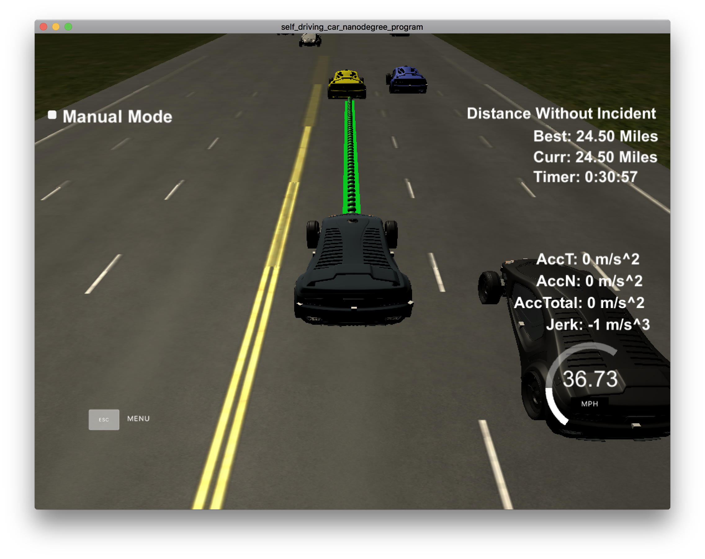
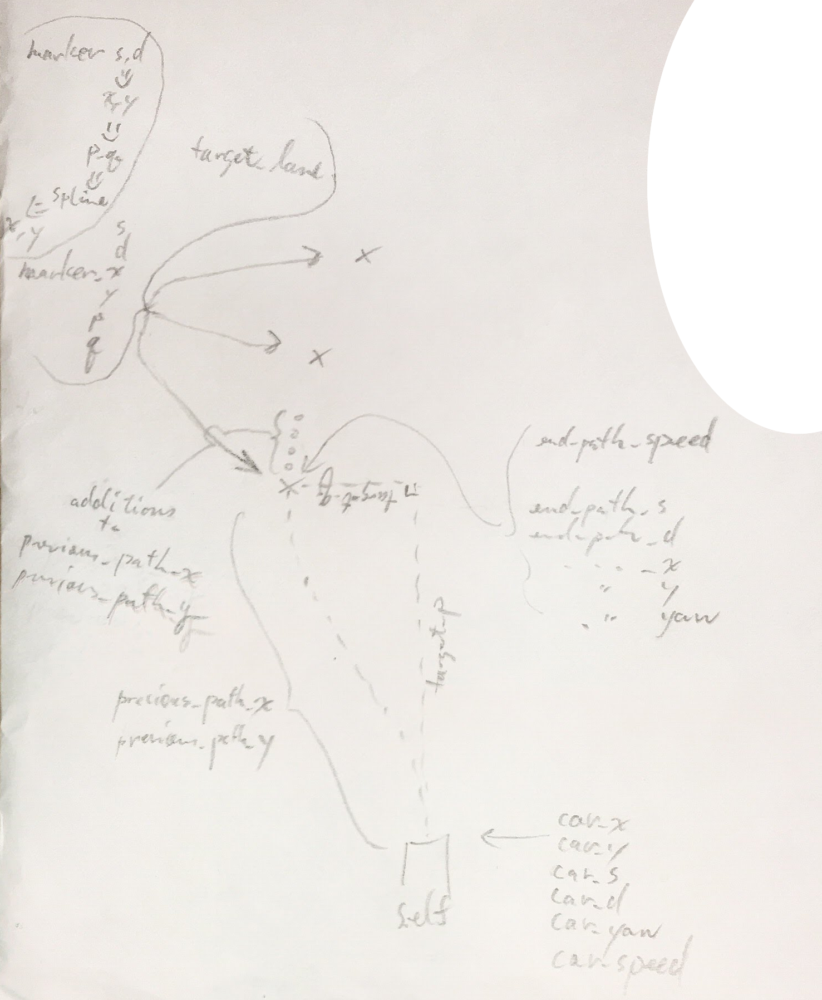
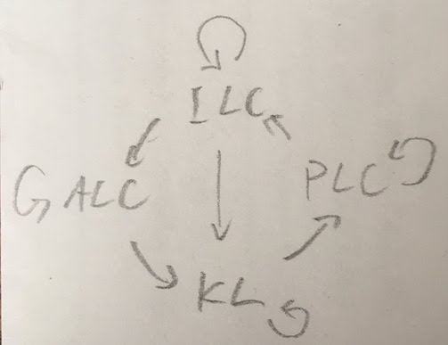
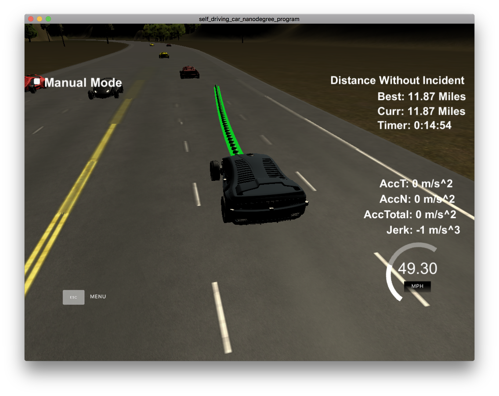

## Note on usage

As explained below, the path generation algorithm is such that the shorter the path it generates for the future, the more strategically safe it is.
However, reducing the duration also increases the risk that the algorithm cannot finish processing a simulator event within that duration, hence temporarily causing a starvation in path, and leaving behind an irrepairable jerk.
Long processing time can becaused as easily as by refocusing on the simulation window after a while off.
I've reduced the duration to 0.4 second.
But if you're experiencing too many instances of path starvation, please increase the value of `OUTPUT_PATH_DURATION` in `support.h` and recompile.

For reference, the algorithm is safe to execute with as long as 1 second of path generation for the future.
Here is a screenshot showing it can run collision-free for well over 20 miles.

## Path generation

The path generation algorithm is based on code provided in the walkthrough video.

Note, the diagram above uses variable names in the walkthrough video.
The names have all been refactored.

- `car_*` is now `now_*`
- `end_path_*` is now `future_*`
- `previous_path_*` is not `future_path_*`
- `ptsx` and `ptsy` in the video are called "markers", e.g. `markers_*`
- I call the coordinate system in the perspective of the self vehicle `(p, q)`, where `p` is directly forward and `q` points left. This is distinct from `(s, d)`, where `s` is forward along lane and `s` points right.

The path generation uses a single speed for all additional points to be generated.
This does not negatively affect efficiency in speed adjustment or jerk in practice, because at every simulation event, usually exactly 1 additional point is being generated.
If one response to simulation event takes longer than 0.02 seconds to process, the code would have to generate more than 1 point in response to the following simulation event.

For step-by-step details, please see inline documentation in method `generate_path` in `support.cpp`.

## FSM

The FSM has four states. They, with their possible destination states, are listed below:

- `KEEP_LANE` => [unchanged, `PLAN_LANE_CHANGE`]
- `PLAN_LANE_CHANGE` => [unchanged, `INITIATE_LANE_CHANGE`]
- `INITIATE_LANE_CHANGE` => [unchanged, `KEEP_LANE`, `ABORT_LANE_CHANGE`]
- `ABORT_LANE_CHANGE` => [unchanged, `KEEP_LANE`]

The initial state is `KEEP_LANE`.

#### For all states

Regardless of state, at any given time, the self vehicle has to safely follow the vehicle ahead in the target lane.
The target lane is changed by some states, but this need to follow safely always exists.
To do so:

- Get the obstacle ahead in the target lane. Use a margin so that this captures obstacles that are about to enter the target lane.
- Calculate, given the present speed and position of both vehicles, 1) the gap in position, 2) how long it would take for them to collide.
- Calculate the same information again, using the estimated future position and speed for both vehicles.
- Use all above information to determine whether the relationship between the self and the obstacle is considered safe.
- Depening on whether safe or not, set the target speed to either the obstacle speed or the speed limit.

After the FSM returns the target speed, a simple actuator code adjusts self's speed towards the target speed,
made with a constant acceleration value, applied either positively or negatively.
The self's adjusted speed is fed into path generation.

Time to collision is not sufficient alone as the safety parameter.
When the time is a negative value, it technically indicates that two objects are drifting further apart,
but with noise considered, it is meaningless when the gap between the objects' positions is very small.

Evaluating the present is critical in catching an obstacle that cuts into self's lane in between self's present and future positions.

In this simulation, the exact future positions of the self are known and provided.
I also retain self's speed at the most distant position in the future.

On the other hand, regarding any obstacle, only the current speed and position are known.
Its future position is estimated by assuming that it will keep constant speed.
An obstacle's future position is re-evaluated at every simulation event, so this assumption is not unsafe.
A possible but complicated optimization would be to retain obstacles' histories of acceleration.

I do have the option of discarding some of the already-generated future path points.
However, empirically I found that doing this would add too much risk in causing jumps in path, hence jerk.
(My math or usage of spline must have been wrong. I attempted Polynomial Trajectory Generation too, with equally unsuccessful result.)
The downside of keeping all already-generated points is that actuation is always delayed by a quasi-fixed time interval, the duration of these points.

#### KEEP_LANE

The FSM stays in `KEEP_LANE` as long as the obstacle ahead is not reducing the target speed from the speed limit.
As soon as the obstacle is limiting, it switches to `PLAN_LANE_CHANGE`.

#### PLAN_LANE_CHANGE

- Evaluate safety of changing into all adjacent lanes, without executing any.
- When safe changes are found, see if any change is more optimal, with optimality defined as increase in the time to collide compared to when simply keeping the current lane. Time to collide is the cost function.
- Choose the most optimal change.
- When a safe and more optimal lane is found, the transition to `INITIATE_LANE_CHANGE`.

All evaluations are done as of the future time.

To compensate for the knowledge that actuation is always delayed, safety is defined by more conservative parameters of 1) gap in position, 2) time to collide -- than the parameters used for following a lane.

Note, safe positional gap is checked in the `s` direction only, and not `d`.
Hence, a possible improvement is to adjust the safety `s` gap proportionally to speed.

Evaluation is done for directly adjacent lanes only, not for 2 lanes over.
Therefore, the algorithm is not smart enough to slow down into the middle lane in order to move 2 lanes over.

The cost function is 1) safety yes/no, 2) time to collision.
The cost function does not use gap in position.
This explains why the self stays behind if adjacent lanes have positional advantage but are travelling at slower speed, hence time-to-collision disadvantage.
Conversely, even if positional advantage is small, the self changes to that lane as long as time-to-collision advantage exists.
See example image below, showing the self chooses to use the right lane because the time to collision is infinity (again using 1-second path generation for visualization).

#### INITIATE_LANE_CHANGE

- Use the following logic shared by all FSM states; only the target lane was changed recently.
- However, check the safety of the new lane by looking both ahead and behind, not just ahead.
- If unsafe, reset target lane and switch to `ABORT_LANE_CHANGE`.
- If the `d` position has sufficiently entered the target lane, switch to `KEEP_LANE`.

The safety parameters used are the more relaxed parameters for following, not the more conservative ones used by `PLAN_LANE_CHANGE`.
This is important because otherwise the self could accelerate or descelerate during lane change, only to bring back normal following behavior when lane change is complete.
And this could be fine if lane change succeeds, but it would be dangerous when lane change has to be aborted: the self might have to slow down immediately *and* change back into its original lane.
A possible improvement is for `PLAN_LANE_CHANGE` to check safety regarding the obstacle behind in the original lane too, using the conservative safety parameters, so that aborting is known to be safe.

I used to have the FSM fully commit to a lane change after `d` position has moved beyond a threshold.
This was removed, in the interest of recognizing obstacles that merge from 2 lanes over, very late into the self's lane change.
In other words, currently, aborting is possible all the way till lane change is recognized as done.

A possible improvement would be to evaluate the lane beyond and use that lane as an optional lane to abort to.

#### ABORT_LANE_CHANGE

- Does NOT check safety. The lane change commits to restoring the (previously resetted) target lane.
- If the `d` position has sufficiently entered the target lane, switch to `KEEP_LANE`.

#### Summary

For step-by-step details, please see inline documentation in method `iterate_fsm` in `support.cpp`.
